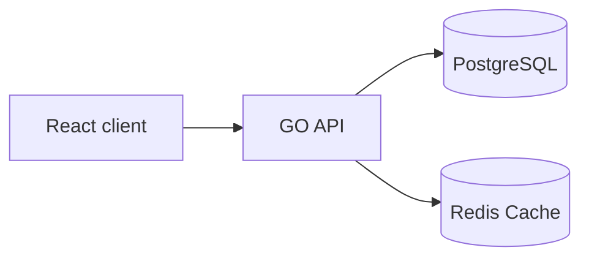

# Architecture

Main components of the system:

- React frontend (Editor + Viewer)
- Golang backend API
- PostgreSQL persistence
- Google OAuth authentication
- Owner-managed allowlist for editor access
- Public share links generated by backend
- Redis cache for public timeline reads

## High-level design

## Public link model

- When a timeline is created, the backend generates a random ID.
  - High-entropy token (32+ random bytes encoded as URL-safe base64).
- Public URL looks like: `/p/{public_id}`.
- Publishing sets the is_public bool flag to true.
- Unpublish revokes visibility by setting the bool flag to false and rotating the public ID.

## Endpoints (prefixed: /api/v1)

| method | path                            | description                                                       |
| ------ | ------------------------------- | ----------------------------------------------------------------- |
| GET    | /health                         | service health check info                                         |
| GET    | /timelines                      | get timelines                                                     |
| GET    | /timelines/:id                  | get timeline by id (for authenticated users)                      |
| PATCH  | /timelines/:id                  | edit timeline (publishing also happens here)                      |
| DELETE | /timelines/:id?hard=true        | delete timeline (hard delete if hard=true, otherwise soft delete) |
| POST   | /timelines                      | create new timeline                                               |
| GET    | /p/:id                          | get timeline by id (for unauthenticated access)                   |
| GET    | /timelines/:id/events           | get timeline events by timeline id                                |
| POST   | /timelines/:id/events           | create new event in timeline                                      |
| PATCH  | /timelines/:id/events/:event_id | edit timeline event                                               |
| DELETE | /timelines/:id/events/:event_id | hard delete timeline event                                        |

## Basic User Flow

1. User logs in via Google OAuth from React Editor.
2. Frontend sends token to Go API.
3. API authorizes user against owner/allowlist and allows editor actions.
4. Timelines are saved in PostgreSQL.
5. User publishes timeline. (a complex public ID was already generated on timeline creation)
6. Visitor opens public link `/p/:public_id`.
7. API checks Redis for cached public timeline.
8. On cache hit, API returns cached payload.
9. On cache miss, API reads PostgreSQL, returns payload, and populates Redis with TTL.
