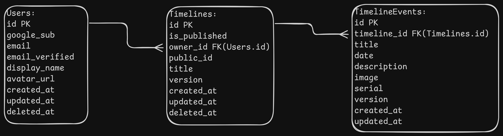

# Data Models

## Persistence via PostgreSQL

### Identity and Sync Rules:

- Database UUIDs for internal primary keys (`id`) on all tables.
- Globally unique, high entropy key(`public_id`) for shareable timeline URLs.
- `version` fields for optimistic concurrency.
- `deleted_at` for soft deletes.

Google OAuth identity rules:

- Google subject (`sub`) as the stable external identity key.
- Email as a profile attribute (it can change), not as the external identity key.
- `email_verified` for access/publishing policy decisions.

### Models

```js
Timelines (
    id UUID PK
    is_published BOOLEAN NOT NULL DEFAULT false
    owner_id UUID NOT NULL // FK -> Users.id
    public_id TEXT NOT NULL UNIQUE
    title TEXT NOT NULL
    version INTEGER NOT NULL DEFAULT 1 // optimistic concurrency
    created_at TIMESTAMPTZ NOT NULL DEFAULT now()
    updated_at TIMESTAMPTZ NOT NULL DEFAULT now()
    deleted_at TIMESTAMPTZ NULL
)

Indexes:
- (owner_id, updated_at)
- partial index on (public_id) where is_published = true and deleted_at is null
```

```js
TimelineEvents (
    id UUID PK
    timeline_id UUID NOT NULL // FK -> Timelines.id ON DELETE CASCADE
    title TEXT NOT NULL
    date TEXT NOT NULL // user-defined display date
    description TEXT NOT NULL DEFAULT ''
    image TEXT NULL // image URL
    serial INTEGER NOT NULL // position in event list
    version INTEGER NOT NULL DEFAULT 1 // optimistic concurrency
    created_at TIMESTAMPTZ NOT NULL DEFAULT now()
    updated_at TIMESTAMPTZ NOT NULL DEFAULT now()
)

Indexes:
- (timeline_id)
```

```js
Users(
    id UUID PK
    google_sub TEXT NOT NULL UNIQUE // Google user identifier (OIDC sub)
    email TEXT NOT NULL
    email_verified BOOLEAN NOT NULL DEFAULT false
    display_name TEXT NULL
    avatar_url TEXT NULL
    created_at TIMESTAMPTZ NOT NULL DEFAULT now()
    updated_at TIMESTAMPTZ NOT NULL DEFAULT now()
    deleted_at TIMESTAMPTZ NULL
)

Indexes:
-
```

### Entity Relationship Diagram


